# OpsPilot SaaS

## Overview

OpsPilot is an AI-powered operations platform for small service businesses.

The platform connects business signals from email, invoices, customer messages, internal notes, and operational workflows, then turns those signals into owner-approved actions, revenue recovery opportunities, customer-risk alerts, and execution tasks.

Think of it as:

```text
Gmail + QuickBooks + Notion + Slack + AI operations assistant
```

The project was built as part of my Software Engineering, Cloud SaaS, AI Engineering, and Platform Engineering portfolio to demonstrate full-stack product development, backend architecture, role-based access control, AI-assisted workflow automation, database design, and deployment readiness.

---

## Production SaaS Capabilities

OpsPilot includes production-style SaaS foundations beyond a static demo:

* Clerk authentication for real user sign-in
* Neon Postgres persistence for deployed workspace data
* Multi-tenant workspace resolution per authenticated user
* Owner, manager, and staff role-based access control
* Invited-user workspace joining by verified email identity
* Owner-approved AI action workflow with approve and dismiss controls
* Runtime health endpoint for deployment and dependency diagnostics
* GitHub Actions CI for tests, linting, typechecking, and production builds
* Vercel deployment connected to managed Postgres

---

## Case Study

### Problem

Small service businesses often lose money because important work is spread across inboxes, invoices, calendars, notes, and customer messages. Leads go unanswered, invoices become overdue, complaints are missed, and owners do not always have time to review every operational signal manually.

### Solution

OpsPilot turns messy business signals into a prioritized operations queue. It scans messages, identifies revenue leaks and customer risks, drafts the next action, and keeps every outbound action behind an owner approval step.

### Engineering Approach

The application was designed as a production-style SaaS rather than a static prototype. Authentication is handled with Clerk, workspace data is persisted in Neon Postgres, and a repository layer keeps local JSON development separate from deployed PostgreSQL storage. Server-side permission checks enforce owner, manager, and staff access levels across billing, team management, inbox scanning, and action approval.

### Result

The project demonstrates a complete SaaS workflow: authenticated users join tenant workspaces, owners invite teammates, business signals generate AI-assisted actions, approved work moves into an execution queue, and the impact ledger tracks estimated recovered revenue and time saved.

---

## Platform Features

OpsPilot automates and demonstrates:

* AI-assisted business signal ingestion
* Manual operations note classification
* Gmail-style inbox importing and scanning
* Revenue leak detection
* Customer-risk detection
* Owner approval workflow
* Execution queue for approved actions
* Impact ledger for estimated revenue and time saved
* Team roles and permissions
* Clerk-ready production authentication
* SaaS billing-plan interface
* PostgreSQL-ready repository layer
* Live Vercel deployment connected to Neon Postgres
* Health checks and runtime configuration diagnostics
* GitHub Actions CI for test, lint, typecheck, and build validation

---

## Architecture

User / Business Owner

↓

Next.js SaaS Dashboard

↓

API Routes

↓

AI Classification + Business Rules

↓

Repository Layer

↓

Local JSON Storage or PostgreSQL

### Application Layers

* Frontend
  * Next.js App Router
  * React command center dashboard
  * Onboarding flow
  * Role-aware interface controls
  * Inbox, ingestion, approval, impact, and execution views

* Backend
  * Next.js API routes
  * Clerk-ready authentication boundary
  * Signed-cookie prototype authentication
  * Server-side permission checks
  * Workspace repository abstraction
  * Runtime health checks

* AI / Automation
  * Rule-based classifier for free local development
  * Optional OpenAI classifier boundary
  * Business action generation
  * Revenue leak detection
  * Customer-risk detection

* Data Layer
  * Local JSON repository for development
  * Neon Postgres for production-style persistence
  * Database schema for tenants, users, actions, risks, ingestions, approvals, impact entries, and execution jobs

* Integrations
  * Mock Gmail connector for safe demos
  * Real Gmail OAuth foundation
  * Read-only Gmail import scope

---

## Technologies Used

* Next.js
* React
* TypeScript
* Node.js
* PostgreSQL
* Neon
* Clerk
* SQL
* Git
* GitHub
* GitHub Actions
* Vercel-ready deployment structure
* OpenAI API integration boundary
* Google Gmail OAuth integration boundary
* Vitest
* ESLint

---

## Core Product Workflows

### Business Signal Ingestion

```text
Pasted text or inbox message
↓
Classifier
↓
Structured action, revenue, and risk records
↓
Workspace repository
↓
Dashboard update
```

### Approval Workflow

```text
AI recommendation
↓
Owner approves or dismisses
↓
Approval event is recorded
↓
Impact entry is created
↓
Execution job is queued
```

### Execution Workflow

```text
Approved action
↓
Queued job
↓
Completed or failed status
↓
Operational accountability
```

---

## Features Implemented

* Command center dashboard
* Daily business brief
* Manual ingestion workflow
* Gmail-style inbox scan workflow
* Revenue leak dashboard
* Customer-risk dashboard
* Action approval and dismissal
* Approval audit events
* Impact ledger
* Execution queue
* Team roles: owner, manager, and staff
* Clerk-ready login flow
* Billing-plan interface
* Workspace onboarding
* Settings management
* Local file repository
* PostgreSQL repository
* Database schema
* Runtime health endpoint
* GitHub Actions CI
* Unit tests for classifier, config, permissions, and workspace flow

---

## Database Tables

The PostgreSQL schema provisions:

* businesses
* users
* connected_accounts
* customers
* business_actions
* revenue_leaks
* customer_risks
* inbox_messages
* ingestions
* knowledge_documents
* timeline_events
* approval_events
* impact_entries
* execution_jobs

---

## Validation

The project was validated using:

```bash
npm run test
npm run lint
npm run typecheck
npm run build
npm run check:config
```

Database readiness can be checked using:

```bash
npm run db:schema
npm run db:check
```

The live deployment health endpoint verifies:

```text
repository: postgres
reachable: true
mode: postgres
```

GitHub Actions runs the main validation pipeline automatically:

```bash
npm ci
npm run test
npm run lint
npm run typecheck
npm run build
```

---

## Local Development

Install dependencies:

```bash
npm install
```

Start the development server:

```bash
npm run dev
```

Open the app:

```text
http://localhost:3000
```

Check runtime health:

```text
http://localhost:3000/api/health
```

---

## Environment Variables

Local development uses safe defaults and does not require paid APIs.

```text
OPSPILOT_AI_PROVIDER=rules
OPSPILOT_REPOSITORY=file
OPSPILOT_DEV_ROLE=owner
OPSPILOT_SESSION_SECRET=replace-with-a-long-random-secret
```

Optional production authentication with Clerk:

```text
NEXT_PUBLIC_CLERK_PUBLISHABLE_KEY=pk_...
CLERK_SECRET_KEY=sk_...
```

Production-style PostgreSQL mode:

```text
OPSPILOT_REPOSITORY=postgres
DATABASE_URL=postgres://...
DATABASE_SSL=true
OPSPILOT_SESSION_SECRET=...
OPSPILOT_TOKEN_ENCRYPTION_KEY=...
```

Optional OpenAI classification:

```text
OPSPILOT_AI_PROVIDER=openai
OPENAI_API_KEY=sk-...
OPENAI_MODEL=gpt-4.1-mini
```

Optional Gmail OAuth:

```text
GOOGLE_CLIENT_ID=...
GOOGLE_CLIENT_SECRET=...
GOOGLE_REDIRECT_URI=https://your-domain.com/api/connectors/gmail/callback
```

---

## Deployment

This project is ready to be deployed from GitHub to Vercel.

The live deployment is connected to Neon Postgres through Vercel environment variables. No database credentials are stored in the repository.

Recommended deployment flow:

* Push source code to GitHub
* Import the GitHub repository into Vercel
* Attach Neon Postgres as the managed database provider
* Add environment variables in Vercel
* Add Clerk keys when production authentication is enabled
* Run the database schema
* Verify `/api/health`
* Keep AI and Gmail OAuth disabled until credentials are configured

For a production-style deployment:

* Use PostgreSQL instead of local file storage
* Use Clerk for production sign-in
* Set a strong session secret
* Set a token encryption key before enabling Gmail OAuth
* Use Gmail read-only scope only
* Keep email sending disabled until a separate safety review is completed

---

## Skills Demonstrated

### Full-Stack Software Engineering

* Next.js App Router
* React dashboard development
* TypeScript domain modeling
* API route development
* Form and workflow handling

### Backend Engineering

* Repository pattern
* Server-side permissions
* Runtime configuration validation
* Health check endpoint
* PostgreSQL persistence layer

### AI Engineering

* AI-assisted classification workflow
* Rule-based fallback system
* Structured business action generation
* OpenAI integration boundary
* Human approval workflow for AI recommendations

### SaaS Product Engineering

* Multi-role team access
* Billing-plan interface
* Tenant workspace model
* Approval audit trail
* Impact tracking
* Execution queue

### DevOps and Deployment

* GitHub repository setup
* GitHub Actions CI
* Vercel-ready application structure
* Environment variable management
* Production database preparation

---

## Future Improvements

* Add production authentication with organization membership
* Connect a hosted PostgreSQL database
* Deploy the app to Vercel
* Configure Clerk production authentication keys
* Add real Gmail OAuth import in production
* Add QuickBooks integration
* Add calendar integration
* Add Slack or Microsoft Teams integration
* Add confirmed revenue tracking
* Add background job processing
* Add notification workflows
* Add observability and error monitoring

---

## Screenshots

### Workspace Setup

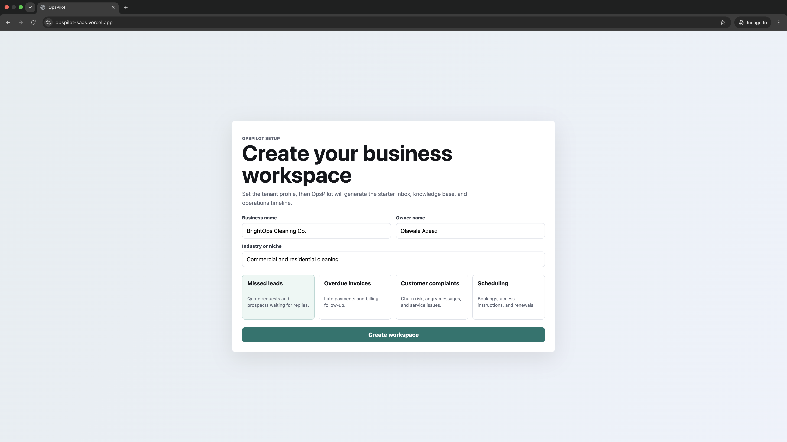

### Dashboard / Daily Brief

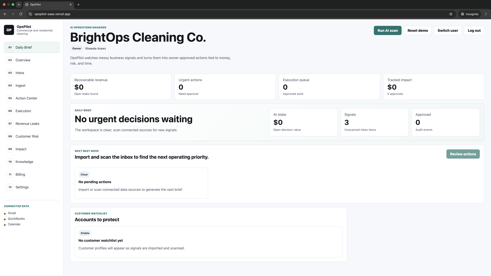

### Action Center Approval Flow

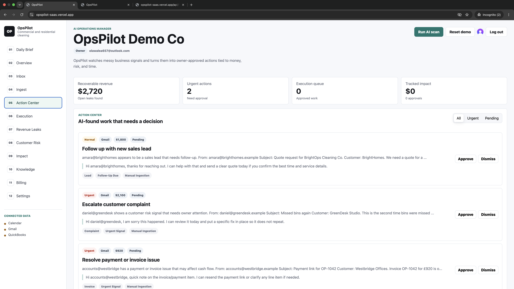

### Staff Role Limited Access

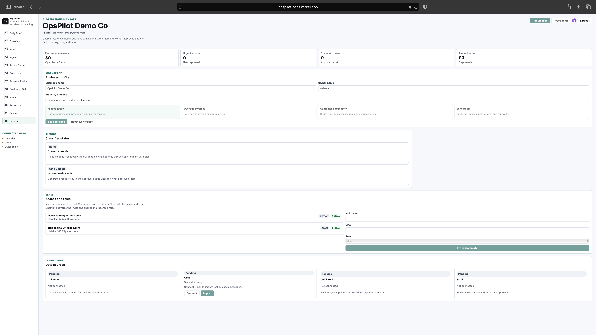

### Inbox

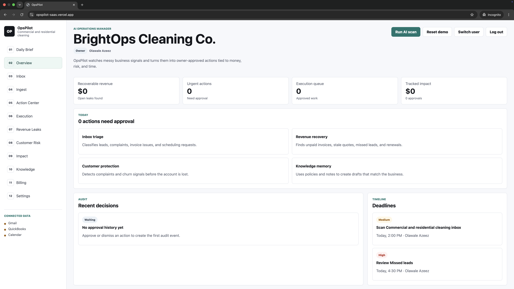

### Manual Ingest

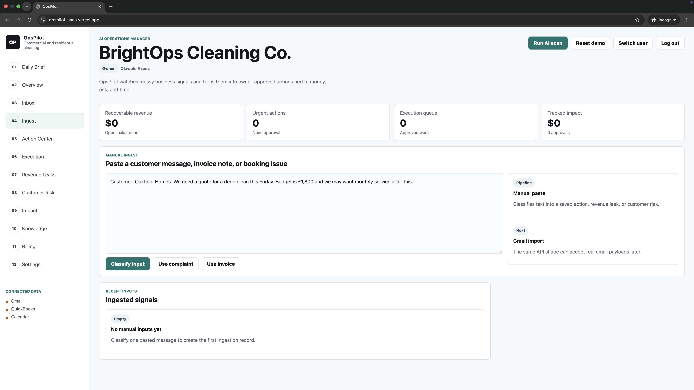

### Customer Risk

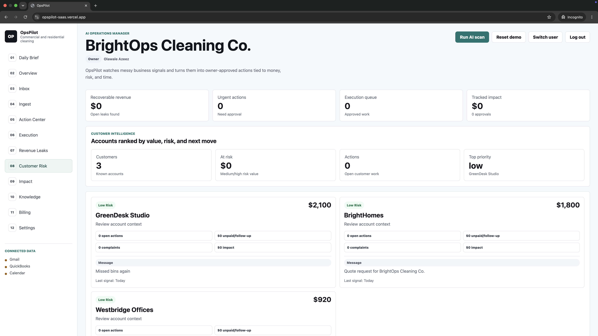

### Impact Ledger

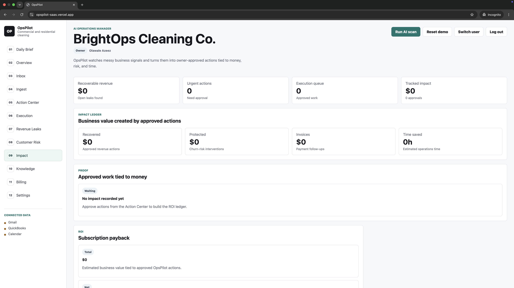

### Execution Queue

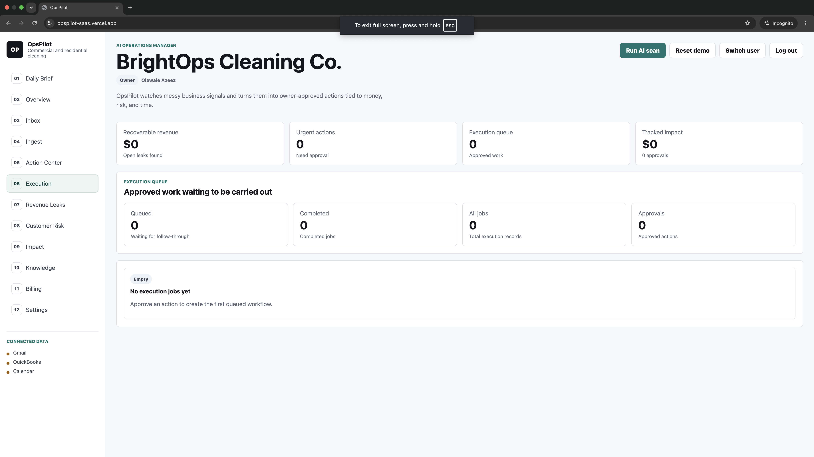

### GitHub Actions CI

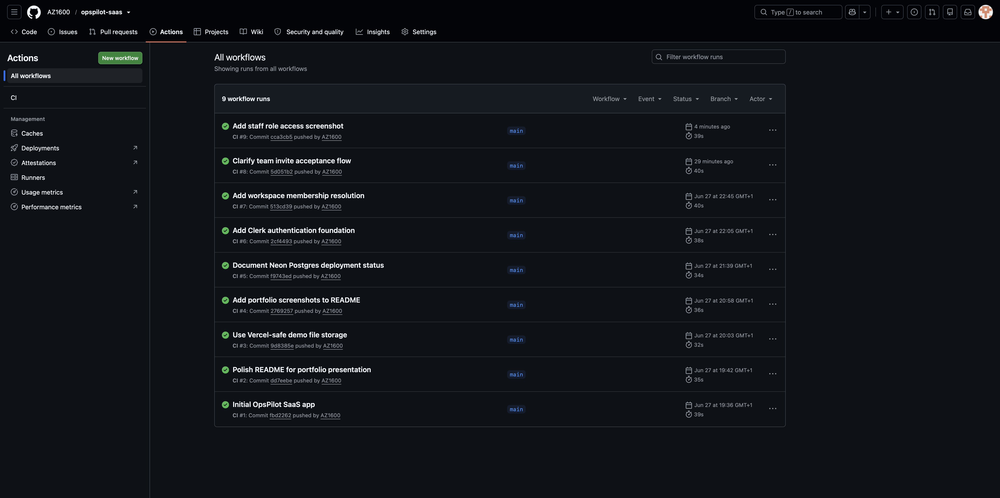

### Vercel Deployment

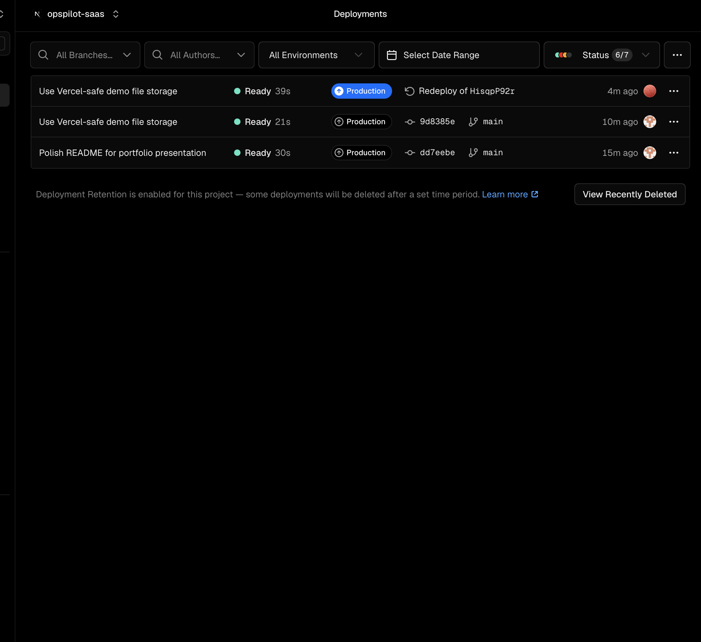

---

## Author

Olawale Azeez

AWS Certified Solutions Architect - Associate

AWS Certified Cloud Practitioner

Aspiring Platform Engineer | Cloud Engineer | DevOps Engineer | Software Engineer
