# OpsPilot SaaS

## AI-Assisted Operations Platform for Small Service Businesses

OpsPilot is a production-style SaaS operations platform designed to help small service businesses turn fragmented operational signals into prioritized, owner-approved actions.

The platform brings together business signals from inboxes, invoices, customer messages, internal notes and operational workflows, then converts them into structured actions, revenue opportunities, customer-risk alerts and execution tasks.

Rather than allowing AI-generated recommendations to automatically become business actions, OpsPilot keeps important actions behind an explicit human approval boundary.

```text
Business Signal
      ↓
Classification
      ↓
Recommendation
      ↓
Human Approval
      ↓
Execution
      ↓
Impact Tracking
```

The project demonstrates practical full-stack SaaS engineering across authentication, multi-tenancy, role-based access control, PostgreSQL persistence, AI-assisted workflows, billing foundations, CI/CD and cloud deployment.

---

## Problem

Small service businesses often operate across several disconnected systems:

- Email
- Invoices
- Customer messages
- Internal notes
- Calendars
- Operational tools

Important signals can easily be missed.

A lead may remain unanswered, an invoice can become overdue, a customer complaint may go unnoticed, or an operational task may never reach the right person.

Owners often have the information required to act, but not a single system that turns those signals into a prioritized operational workflow.

---

## Solution

OpsPilot converts fragmented business information into an operations queue.

The platform can:

- Ingest business notes and inbox-style messages
- Classify operational signals
- Identify possible revenue leaks
- Detect customer-risk signals
- Generate recommended actions
- Route decisions through human approval
- Queue approved work for execution
- Track estimated business impact
- Maintain an operational audit trail

The goal is not to replace human decision-making.

Instead, OpsPilot provides structured evidence and recommendations while keeping the business owner in control of important actions.

---

## Core Workflow

```text
Email / Note / Business Signal
            ↓
      Signal Ingestion
            ↓
 Classification + Business Rules
            ↓
 ┌──────────┼─────────────┐
 ↓          ↓             ↓
Action   Revenue Leak   Customer Risk
            ↓
      Workspace Queue
            ↓
       Human Review
            ↓
     Approve / Dismiss
            ↓
       Execution Job
            ↓
       Impact Ledger
```

---

## Production-Style SaaS Architecture

OpsPilot was designed as more than a static dashboard.

The project includes SaaS foundations such as:

- Multi-tenant workspaces
- Clerk authentication integration
- Owner, manager and staff roles
- Server-side permission enforcement
- Neon PostgreSQL persistence
- Repository abstraction between local and hosted storage
- Owner-approved AI-assisted actions
- Execution queues
- Audit events
- Stripe billing foundations
- Runtime health checks
- GitHub Actions CI
- Vercel deployment support

---

## Architecture

```text
User / Business Owner
        │
        ▼
Next.js + React Application
        │
        ▼
Authentication + Workspace Resolution
        │
        ▼
Next.js API Routes
        │
        ▼
AI Classification + Business Rules
        │
        ▼
Repository Layer
        │
        ├───────────────┐
        ▼               ▼
Local JSON          PostgreSQL
Development         Neon / Hosted
        │
        ▼
Actions / Risks / Approvals
        │
        ▼
Execution + Impact Tracking
```

### Application Layers

#### Frontend

- Next.js App Router
- React dashboard
- Workspace onboarding
- Role-aware navigation
- Daily business brief
- Inbox
- Revenue-risk views
- Action approval interface
- Execution queue
- Impact ledger

#### Backend

- Next.js API routes
- Authentication boundary
- Workspace resolution
- Server-side authorization
- Repository abstraction
- Runtime configuration validation
- Health checks

#### AI and Automation

- Deterministic rule-based classifier for local development
- Optional OpenAI integration boundary
- Structured business-action generation
- Revenue-leak detection
- Customer-risk detection
- Human approval workflow

#### Data Layer

- Local JSON repository for development
- Neon PostgreSQL for hosted persistence
- Multi-tenant workspace data model
- Operational audit data
- Execution records
- Impact tracking

#### Integrations

- Gmail-style demonstration connector
- Gmail OAuth foundation
- Read-only Gmail import design
- Stripe Checkout foundation
- Stripe Customer Portal foundation
- Stripe webhook synchronization

---

## Key Features

### Multi-Tenant Workspaces

Authenticated users are resolved into their workspace rather than accessing one shared global dataset.

Workspace data is separated so users operate inside their assigned business context.

---

### Role-Based Access Control

OpsPilot defines three primary roles:

```text
Owner
Manager
Staff
```

Permissions are enforced server-side for sensitive operations including:

- Team management
- Billing
- Inbox scanning
- Action approval
- Workspace administration

---

### Business Signal Ingestion

Users can submit operational notes or import inbox-style messages.

```text
Business Signal
      ↓
Classifier
      ↓
Structured Records
      ↓
Workspace Repository
      ↓
Dashboard Update
```

The system can generate:

- Business actions
- Revenue-leak records
- Customer-risk records

---

### Revenue Leak Detection

OpsPilot can identify signals that may represent missed revenue opportunities.

Examples include:

- Overdue invoices
- Unanswered enquiries
- Missed follow-ups
- Unresolved customer requests

The resulting signal is presented for human review rather than automatically acted upon.

---

### Customer Risk Detection

Operational messages can be classified into customer-risk records so important issues can be surfaced and prioritized.

---

### Human Approval Workflow

AI-assisted recommendations remain behind a human approval boundary.

```text
Recommendation
      ↓
Owner Review
      ↓
Approve or Dismiss
      ↓
Audit Event
      ↓
Execution Queue
```

Approval state is recorded so operational decisions remain traceable.

---

### Execution Queue

Approved actions are converted into execution jobs.

Jobs can move through states such as:

```text
Queued
  ↓
Completed

or

Queued
  ↓
Failed
```

This provides visibility into what was recommended, what was approved and what actually happened.

---

### Impact Ledger

OpsPilot maintains an impact ledger for estimated operational outcomes such as:

- Revenue recovered
- Time saved
- Actions completed
- Operational opportunities identified

The ledger is designed to make automation impact visible rather than treating AI recommendations as isolated outputs.

---

## Public Demo and Authenticated SaaS

OpsPilot separates portfolio exploration from authenticated tenant access.

```text
/
```

Public product overview.

```text
/demo
```

Read-only portfolio workspace using bundled demonstration data.

No authentication is required.

```text
/login
```

Authentication entry point when Clerk is configured.

```text
/app
```

Authenticated SaaS workspace with server-side permissions.

The public demo does not load private workspace data and does not call mutation endpoints.

Actions including approvals, execution, billing changes, connector configuration, settings changes and workspace reset are disabled in demonstration mode.

---

## Technology Stack

### Frontend

- Next.js
- React
- TypeScript

### Backend

- Next.js API Routes
- Node.js
- TypeScript

### Database

- PostgreSQL
- Neon
- SQL

### Authentication

- Clerk
- Server-side RBAC

### AI and Automation

- Rule-based classification
- OpenAI integration boundary
- Structured recommendation workflows
- Human-in-the-loop approval

### SaaS

- Stripe Checkout foundation
- Stripe Customer Portal
- Stripe webhook integration
- Multi-tenant workspace model

### DevOps

- Git
- GitHub
- GitHub Actions
- Vercel
- Environment-based configuration

### Testing

- Vitest
- ESLint
- TypeScript compiler
- Production build validation

---

## Database Model

The PostgreSQL schema includes:

```text
businesses
users
connected_accounts
customers
business_actions
revenue_leaks
customer_risks
inbox_messages
ingestions
knowledge_documents
timeline_events
approval_events
impact_entries
execution_jobs
```

These tables support the complete operational workflow from signal ingestion through approval, execution and impact tracking.

---

## Validation

The project includes automated validation across the application lifecycle.

Run:

```bash
npm run test
npm run lint
npm run typecheck
npm run build
npm run check:config
```

Database checks:

```bash
npm run db:schema
npm run db:check
```

GitHub Actions automatically runs:

```bash
npm ci
npm run test
npm run lint
npm run typecheck
npm run build
```

---

## Runtime Health

The application includes a health endpoint for deployment and database diagnostics.

```text
/api/health
```

A healthy PostgreSQL-backed deployment reports information such as:

```text
repository: postgres
reachable: true
mode: postgres
```

This makes database and runtime configuration problems easier to identify after deployment.

---

## Local Development

### Install dependencies

```bash
npm install
```

### Start development server

```bash
npm run dev
```

Open:

```text
http://localhost:3000
```

Health endpoint:

```text
http://localhost:3000/api/health
```

---

## Local Development Configuration

OpsPilot can run locally without paid AI APIs.

Example configuration:

```env
OPSPILOT_AI_PROVIDER=rules
OPSPILOT_REPOSITORY=file
OPSPILOT_DEV_ROLE=owner
OPSPILOT_SESSION_SECRET=replace-with-a-long-random-secret
```

This allows the core product workflow to be demonstrated without external AI services or a hosted database.

---

## PostgreSQL Configuration

Hosted persistence can use PostgreSQL through Neon.

```env
OPSPILOT_REPOSITORY=postgres
DATABASE_URL=postgres://...
DATABASE_SSL=true
OPSPILOT_SESSION_SECRET=...
OPSPILOT_TOKEN_ENCRYPTION_KEY=...
```

Database credentials are provided through environment variables and are not stored in the repository.

---

## Authentication Configuration

Clerk can be configured using:

```env
NEXT_PUBLIC_CLERK_PUBLISHABLE_KEY=pk_...
CLERK_SECRET_KEY=sk_...
```

Sensitive authorization checks remain server-side.

---

## Optional AI Configuration

The deterministic classifier can be replaced by the OpenAI integration boundary when credentials are configured.

```env
OPSPILOT_AI_PROVIDER=openai
OPENAI_API_KEY=sk-...
OPENAI_MODEL=gpt-4.1-mini
```

AI output remains subject to the same human approval workflow.

---

## Gmail OAuth Foundation

Optional Gmail integration uses OAuth credentials:

```env
GOOGLE_CLIENT_ID=...
GOOGLE_CLIENT_SECRET=...
GOOGLE_REDIRECT_URI=https://your-domain.com/api/connectors/gmail/callback
```

The integration is designed around read-only Gmail access.

Email sending remains disabled until a separate safety and permission review is completed.

---

## Stripe Billing Foundation

Stripe configuration supports the SaaS billing foundation:

```env
STRIPE_SECRET_KEY=sk_test_...
STRIPE_WEBHOOK_SECRET=whsec_...
STRIPE_PRICE_STARTER=price_...
STRIPE_PRICE_GROWTH=price_...
STRIPE_PRICE_PRO=price_...
```

The implementation includes foundations for:

- Checkout
- Customer Portal
- Subscription plans
- Webhook-based plan synchronization

---

## Deployment

OpsPilot supports deployment from GitHub to Vercel with PostgreSQL-backed persistence through Neon.

Typical deployment architecture:

```text
GitHub
   ↓
Vercel
   ↓
Next.js Application
   ↓
Neon PostgreSQL
```

Production configuration should include:

- PostgreSQL instead of local file storage
- Strong session secrets
- Secure environment variables
- Clerk authentication when enabled
- Token encryption before enabling OAuth integrations
- Read-only Gmail scopes
- Runtime health verification
- No credentials committed to source control

---

## Security and Safety Principles

### Human Approval Before Execution

AI recommendations do not automatically execute business actions.

### Server-Side Authorization

Sensitive operations are protected by server-side permission checks.

### Credential Separation

Secrets are supplied through environment variables rather than committed to GitHub.

### Demo Isolation

The public demo uses sample data and does not expose private tenant workspaces.

### Least-Privilege Integrations

External integrations are designed around the minimum required permissions, such as read-only Gmail access.

---

## Screenshots

### Workspace Setup

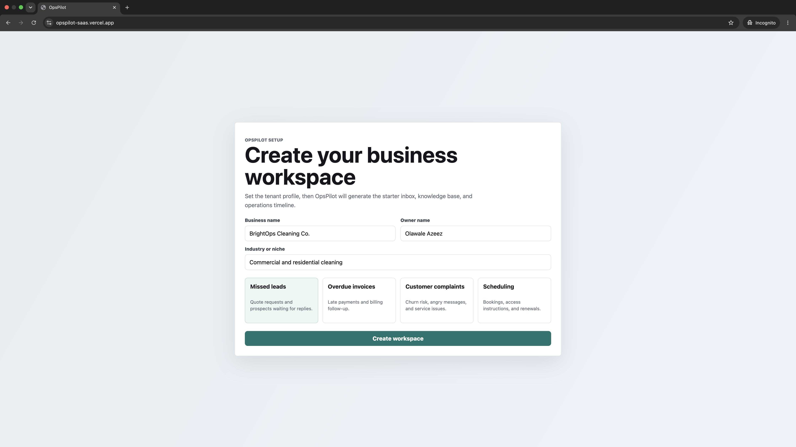

### Dashboard / Daily Brief

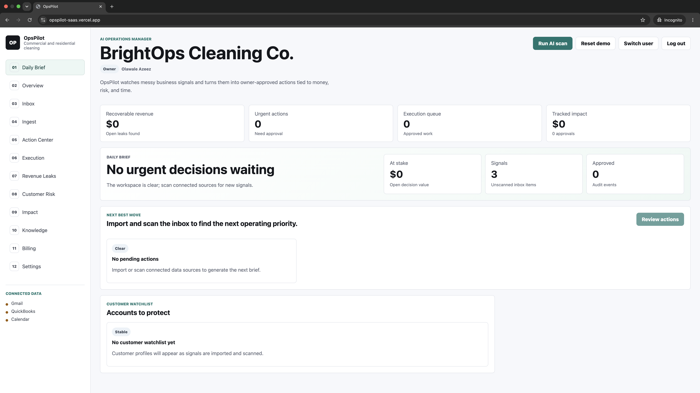

### Action Center Approval Flow

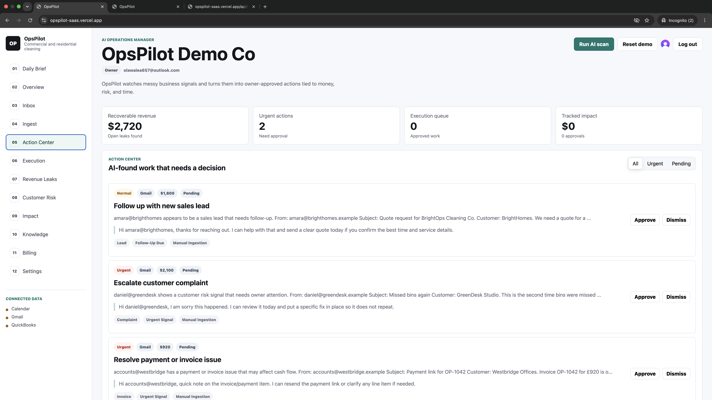

### Staff Role Limited Access

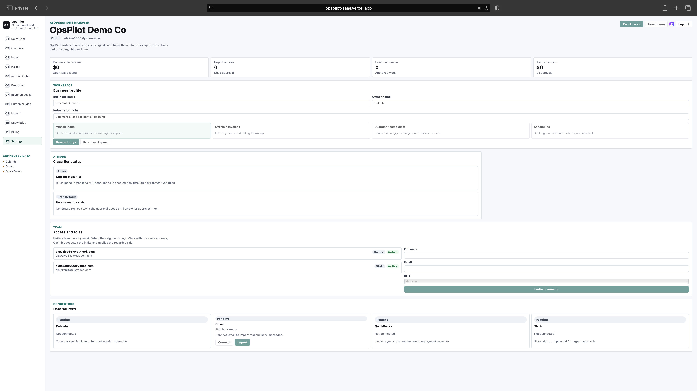

### Inbox

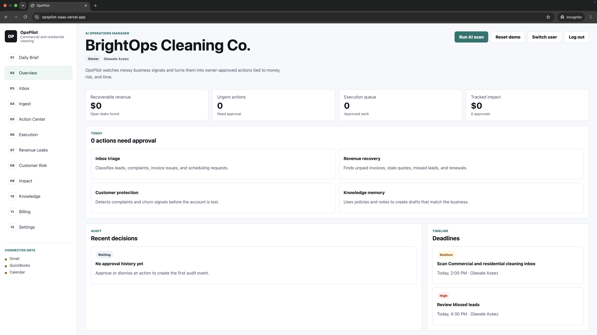

### Manual Ingest

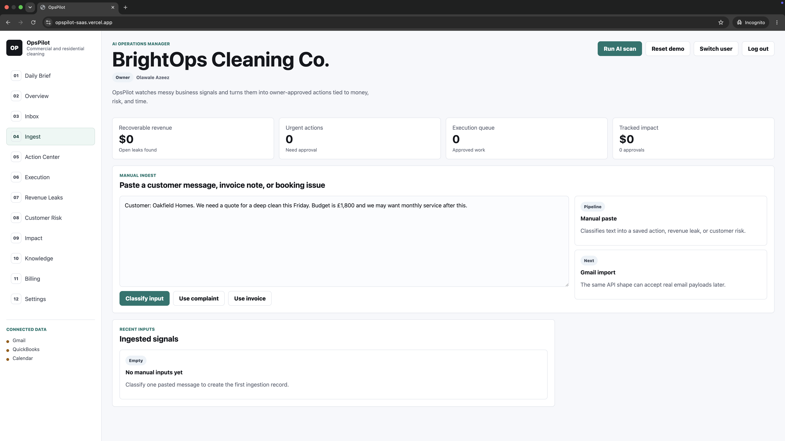

### Customer Risk

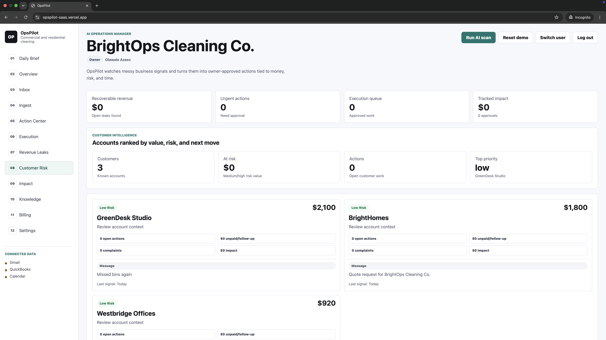

### Impact Ledger

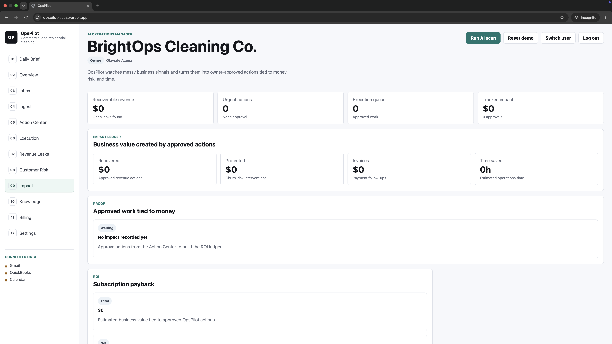

### Execution Queue

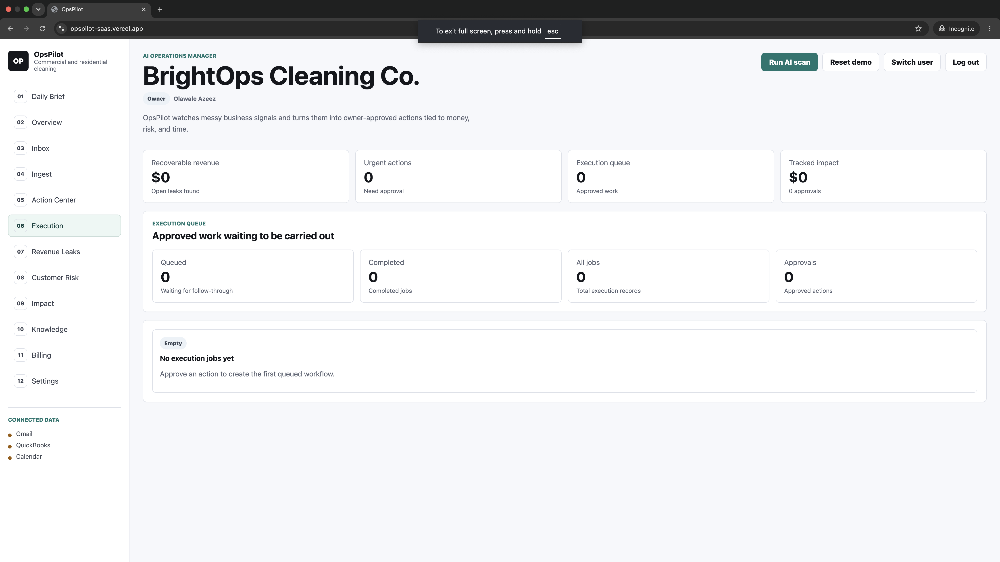

### GitHub Actions CI

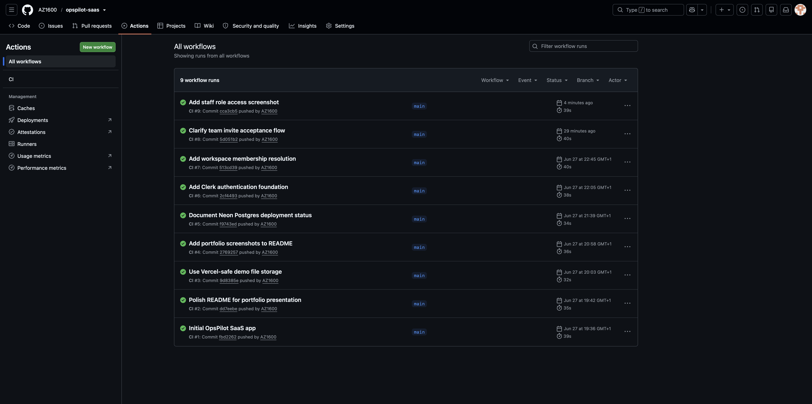

### Vercel Deployment

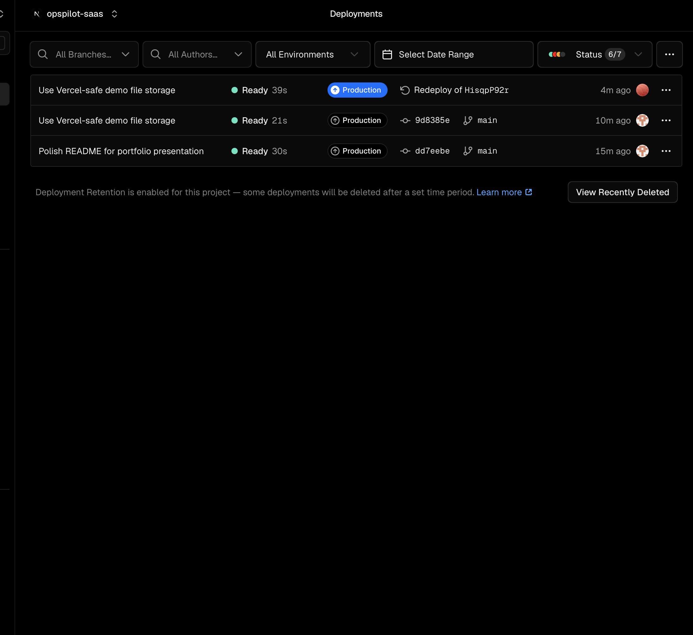

---

## Skills Demonstrated

### Full-Stack Software Engineering

- Next.js App Router
- React application development
- TypeScript domain modeling
- API route development
- Workflow-oriented product design

### Backend Engineering

- Repository pattern
- PostgreSQL persistence
- Server-side authorization
- Runtime configuration
- Health checks
- Multi-tenant data modeling

### SaaS Engineering

- Workspace architecture
- Multi-role access
- Authentication integration
- Billing foundations
- Subscription lifecycle foundations
- Audit trails

### AI Engineering

- Structured AI-assisted classification
- Rule-based fallback
- Human-in-the-loop workflows
- Recommendation generation
- AI integration boundaries

### DevOps and Cloud Deployment

- GitHub Actions CI
- Automated testing
- Type checking
- Production build validation
- Vercel deployment
- Managed PostgreSQL
- Environment variable management

---

## Engineering Principles

### AI Assists, Humans Decide

AI-generated recommendations remain advisory until explicitly approved.

### Build Deterministic Foundations First

The application can run using deterministic classification without requiring a paid AI service.

### Separate Development and Production Storage

The repository layer allows local file storage for development while using PostgreSQL for hosted environments.

### Make Operational Impact Visible

Approvals, execution jobs and impact records are retained so recommendations can be traced through their operational lifecycle.

---

## Roadmap

Planned improvements include:

- Production organization membership
- Real Gmail OAuth import
- QuickBooks integration
- Calendar integration
- Slack or Microsoft Teams integration
- Background job processing
- Notification workflows
- Confirmed revenue tracking
- Production observability and error monitoring
- Expanded integration test coverage
- Additional operational connectors

---

## Project Status

OpsPilot currently demonstrates the core lifecycle of a production-style SaaS operations platform:

```text
Authenticated Workspace
        ↓
Business Signal
        ↓
Classification
        ↓
Recommended Action
        ↓
Human Approval
        ↓
Execution Queue
        ↓
Impact Tracking
```

The project intentionally separates deterministic application logic, optional AI services and external integrations so individual components can be developed and tested without requiring every third-party service to be active.

---

## Author

**Olawale Azeez**

AWS Certified Solutions Architect – Associate
AWS Certified Cloud Practitioner
Cloud Engineer | Platform Engineer | DevOps Engineer | Software Engineer